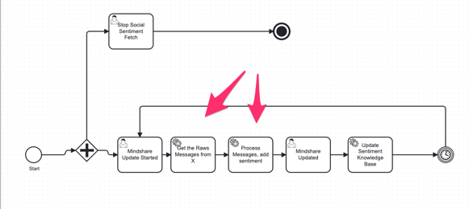

# Social Sentiment Core Worker

## Overview

The **Social Sentiment Core Worker** is a backend service that automates the collection, processing, and analysis of social media sentiment data for a curated list of key opinion leaders (KOLs) and tokens. It integrates with ClickHouse for data storage, MindsDB for AI-powered sentiment analysis, and external APIs (such as RapidAPI) for data collection.

---

## Key Responsibilities

- **Data Collection:** Fetches recent tweets for a list of KOLs and stores raw messages in ClickHouse.
- **Sentiment Processing:** Identifies token mentions in tweets, analyzes sentiment and generates summaries using MindsDB, and stores the results in ClickHouse.
- **Workflow Integration:** Exposes Camunda BPMN tasks for orchestration and can be triggered by external workflow engines or scheduled jobs.

---

## Main Workflow

1. **Fetch Raw Messages**
    - Reads a CSV of KOLs.
    - Fetches their latest tweets via RapidAPI.
    - Stores raw tweets in ClickHouse.

2. **Process Sentiment**
    - Scans unprocessed tweets for token mentions.
    - Uses MindsDB to analyze sentiment and summarize content.
    - Stores processed sentiment data in ClickHouse.

---

## BPMN Diagram

---

## Integration Points

- **ClickHouse:** For storing both raw and processed data.
- **MindsDB:** For AI-powered sentiment analysis and summarization.
- **RapidAPI:** For fetching tweets from Twitter/X.
https://rapidapi.com/davethebeast/api/twitter241/playground/apiendpoint_eab00723-ecc9-4fd0-994e-698d471075e5
- **Camunda:** For workflow orchestration.
